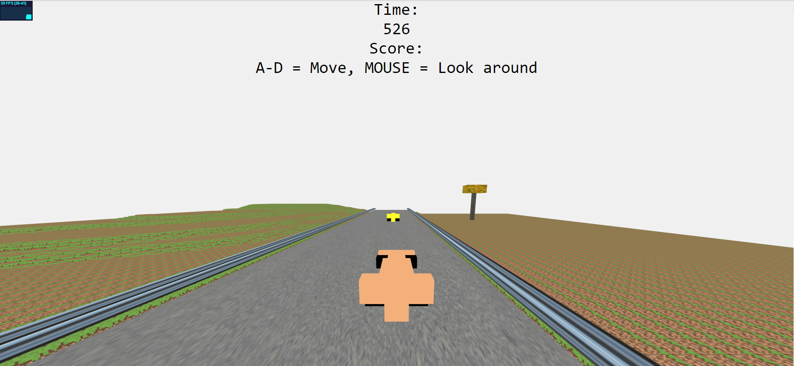

# 30/3/2019

Progetto iniziato. Abbiamo deciso di creare una macchina di formula 1 con i blocchi, partendo dal codice iniziale con le luci "StartingCode-withLights.html"

# 31/3/2019

Creiamo un prototipo di macchina utilizzando MagicVoxel

# 02/3/2019

Iniziamo a programmare. Creiamo una macchina base e la facciamo muovere sul terreno

# 03/03

Creiamo le entità albero e aggiungiamo nella scena. Implementiamo il movimento della macchina usando i tasti WASD

# 04/03

Aggiungiamo una funzione per spawnare 10 macchine e 2 alberi e farli muovere verso la nostra macchina. Quando c'è una collisione, appare "Game over"

# 05/03

Aggiungiamo il terreno, la strada e le decorazioni. Aggiungiamo anche uno scoreboard

Iniziamo a scrivere la relazione

# 06/03
La funzione esterna creaAlbero(); non funziona più, la spostiamo dentro al file principale. 
