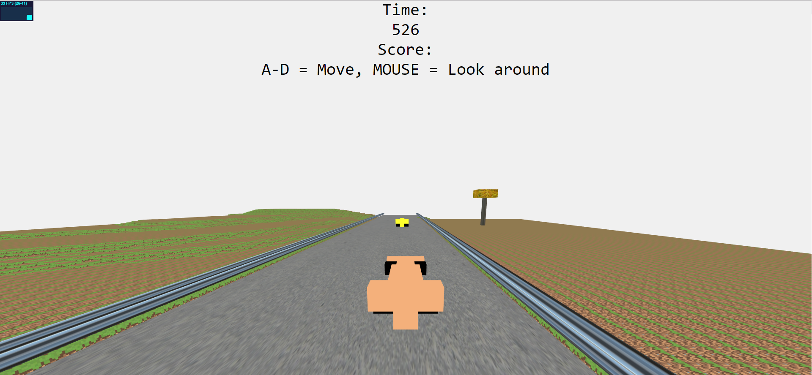
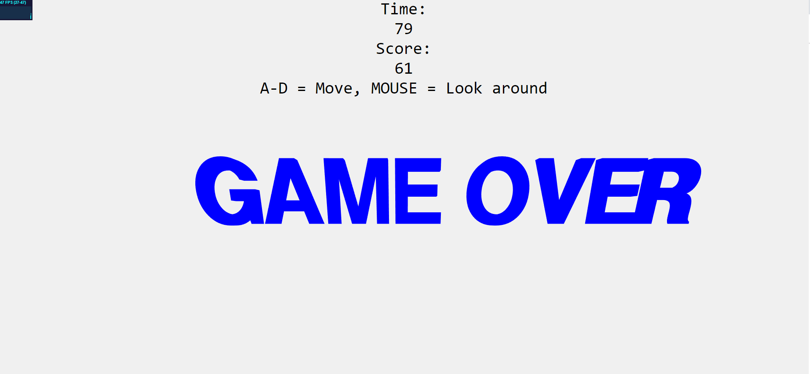

# Introduzione

Università degli studi di Udine

Corso Interactive 3D design

Docente: Roberto Ranon

Gruppo composto da:
- Simon Komjanc: 133878
- Andrej Čavdek: 131098

Anno Accademico 2018/2019

## Problema

Creare una scena facendo uso soltanto di box. Le box possono essere traslate, scalate e ruotate a nostro piacimento.

## Analisi e scelta della scena

Dopo aver discusso su cosa avremmo potuto creare per questo progetto, abbiamo deciso di creare un semplice minigioco. Con l' aiuto di three.js, una libreria/API open source in JavaScript che consente di creare e visualizzare animazioni 3D al computer su di un browser, abbiamo creato diversi modelli per costruire la nostra scena.

## I Models

# Macchina
Inanzitutto abbiamo creato la macchina. Facendo uso delle box abbiamo creato varie parti della macchina come ad esempio il muso, l'alettone, le ruote etc. Infine tutte queste parti le abbiamo aggiunte al corpo principale. Il colore delle macchine è randomico. Solo le ruote restano nere.

# Strada
Fatto ciò abbiamo creato la strada sulla quale si svolgera il minigioco. Abbiamo definito la larghezza e aggiunto una texture.

# Guard Rail
Per rendere tutto un po' più chiaro e realistico abbiamo aggiunto anche il guard rail ai lati della strada. Anche quà abbiamo aggiunto una texture.

# Albero
Semplicemente a scopo estetico abbiamo creato anche un albero. Prima abbiamo fatto un tronco, settato le dimensioni e aggiunto una texture. Dopodichè abbiamo creato la chioma dell'albero e l'abbiamo aggiunta al tronco.

## Codice principale

Per questo progetto abbiamo usato il file StartingCode-withLights.html fornitoci dal docente. Per prima cosa abbiamo collegato tutti i models. Dopodichè abbiamo aggiunto la "scoreboard", stilizzata con il codice css interno, con il punteggio e i comandi.

Dopo aver aggiunto tutti i modelli alla scena, abbiamo creato due funzioni per lo "spawn" delle macchine e  degli alberi. Entrabi le funzioni posizionano casualmente altre macchine sulla strada. Lo stesso fa anche per gli alberi che però verranno posizionati fuori dalla strada. Entrambi le funzioni vengono richiamate nella funzione Update() e il numero di spawn aumenta in base al tempo passato.

/*Abbiamo aggiunto una funzione di controllo per verificare se due oggetti (in questo caso la macchina principale e un'altra macchina) sono entrati in collisione. anche questa funzione viene chiamata nella funzione Update() e nel caso si sia verificata una collisione il gioco finisce. 

Il terreno lo otteniamo partendo da un'immagine in greyscale, codificandola e in base al colore aggiungiamo la texture del terreno in varie altezze(nero altezza 0, più chiaro l'altezza aumenta).

Il gioco finisce in 2 modi: o quando una macchina spawnata colpisce la nostra, oppure se noi andiamo troppo sinistra o troppo a destra nel guard rail.

# Screenshots

## Testing e problemi riscontrati

Il gioco parte dopo 1-2 secondi di caricamento degli oggetti e scorre con un massimo di 40FPS. Dopo 25-30 secondi di gioco, il framerate cala ulteriormente a causa dei troppi oggetti creati. Le collisioni tra due macchine avvengono solo se si toccano al centro (non con le ali anteriori o ruote). A causa della funzione randomica, avvolte le macchine possono spawnare sovrapposte una all'altra. 

## Possibili miglioramenti

- Rimuovere tutti i bug e problemi riscontrati precedentemente
- Aggiungere all'inizio la scelta della difficoltà (maggiore sarà la difficoltà, maggiore sarà la velocità e il numero di macchine spawnate)
- Salvare il record personale su un file per poi vederlo nel gioco e provarlo a batterlo. 
- Aggiungere più decorazioni e migliorare le macchine
- Aggiungere le ombre

